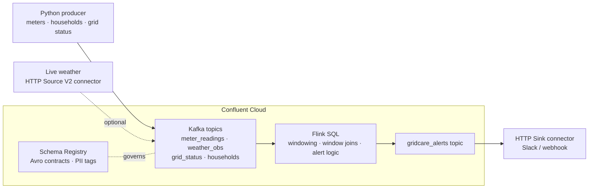

# GridCare 🌡️⚡

**Real-time heat-emergency protection for vulnerable households, built on Confluent's Data Streaming Platform.**

GridCare turns the smart-meter data utilities already collect into welfare alerts for elderly and medically fragile residents whose cooling stops during a heat emergency, within minutes, across millions of homes.

> Submission for the Confluent Dev Day Laptop Challenge: *Build the most impactful app with Confluent's Data Streaming Platform.*

---

## The problem

It's 107°F (heat index) in Houston. Dorothy is 78 and uses an oxygen concentrator. Her AC just stopped working. She lives alone. **Nobody knows.**

Heat is the deadliest weather hazard in the United States, and the people most at risk are older adults and people who depend on powered medical equipment, especially when they are alone at home and lose cooling. It happens in two ways:

- **Area outages.** Storms, grid stress, or planned shutoffs cut power to whole neighborhoods, as when Hurricane Beryl left millions of Houston-area customers without power in July 2024 heat.
- **Individual cooling loss.** The grid is fine, but one person's AC fails, or they turn it off to save money.

Grid stress is getting worse: ERCOT, the Texas grid, set a record peak load of 91.1 GW during a heat wave on July 22, 2026 (EIA Hourly Electric Grid Monitor).

Utilities already hold the signal that could save these lives: **smart-meter data showing a home's power use collapse**. But it sits in billing systems, processed hours or days later.

## The solution

GridCare streams smart-meter readings, weather, and grid status through Kafka, and uses Flink to continuously check three conditions for every enrolled home:

1. The household is in the utility's opt-in **medical baseline / vulnerable customer** program.
2. The neighborhood heat index is **dangerous (≥ 100°F)**.
3. The home's power use has **dropped to near zero** for 10 minutes, meaning cooling has stopped.

When all three are true, GridCare raises an alert and classifies it:

| Alert type | What it means | Who acts |
|---|---|---|
| `AREA_OUTAGE` | Whole ZIP has lost power | Utility prioritizes restoration, directs residents to cooling centers |
| `INDIVIDUAL_COOLING_LOSS` | Power is on, but this home's AC stopped | Caregiver or local services perform a welfare check |

Alerts are `CRITICAL` when the resident depends on a powered medical device, `HIGH` otherwise.

## Architecture



### How GridCare uses the Confluent platform

**Kafka (streaming backbone).** Four input topics carry independent streams keyed for parallelism: `meter_readings` (key: meter), `weather_obs` and `grid_status` (key: ZIP), and `households` (compacted reference data). The same streams can feed many independent consumers (alerts, operations dashboards, compliance logs, model training) without point-to-point integrations.

**Flink (stream processing).** A pipeline of Flink SQL statements in [`flink/gridcare_flink.sql`](flink/gridcare_flink.sql):

1. **Event-time watermarks** on each stream's timestamps.
2. **Tumbling windows** reduce millions of raw readings to one 10-minute usage summary per home (`meter_usage_10m`).
3. **A window join** combines weather and grid status into per-neighborhood conditions (`zip_conditions_10m`).
4. **An enrichment join** with the household registry produces classified, prioritized, human-readable alerts (`gridcare_alerts`).

**Connectors.** An HTTP Sink connector delivers alerts to Slack or a webhook. Optionally, an HTTP Source V2 connector pulls live observations from the National Weather Service API.

**Stream Governance.** Household data combines energy use with medical status, which is highly sensitive, so governance is part of the design rather than an afterthought:

- Every topic has an **Avro schema** registered in Schema Registry, with field documentation.
- `contact_name`, `contact_phone`, and `medical_device` are **tagged as PII**.
- **Stream Lineage** shows exactly where sensitive data flows.

## Why streaming, and why at this scale

A large utility operates millions of smart meters. Even at 1-minute intervals, that is tens of thousands of readings per second, joined continuously against weather and outage data. A batch job that runs every few hours finds a cooling failure too late. GridCare needs:

- **High-throughput ingestion** from millions of devices → Kafka partitions.
- **Stateful, time-windowed logic** ("near-zero usage for 10 minutes while heat index ≥ 100°F") → Flink.
- **Fan-out** of the same data to operations, compliance, and analytics → Kafka consumers.
- **Replay** for auditing decisions and improving thresholds → Kafka retention.

The demo scenario produces about **1.9 million events** for 2,000 homes in one simulated day. The same pipeline scales by adding partitions and Flink capacity.

## Business value

- **Utilities** face regulatory and legal pressure to protect vulnerable customers during outages and shutoffs. GridCare gives them real-time situational awareness and an auditable record that they acted.
- **Restoration priority**: knowing exactly which critical-care customers are in an outage area helps crews and emergency managers decide where to go first.
- **Health plans and care agencies** can connect alerts to existing care-management programs to reduce heat-related hospitalizations.
- **Reuse**: the same meter streams power demand-response and load-forecasting programs that save utilities money during peak events.

## About the data

Household-level smart-meter data is private and is not publicly available as a live feed. That privacy is exactly why GridCare builds governance in from day one.

This project uses a **realistic simulator** ([`simulator/gridcare_simulator.py`](simulator/gridcare_simulator.py)) for a Houston heat-wave day:

- 2,000 homes across 16 Houston ZIP codes, about 15% enrolled in a medical baseline program.
- Temperature and humidity follow a heat-wave daily curve, with heat index computed using the National Weather Service formula.
- AC load scales with outdoor temperature; homes with medical devices draw extra power.
- **Scripted events:** a neighborhood outage in ZIP 77021 from 2:00 to 5:30 PM, and AC failures in three medical-baseline homes elsewhere at 3:00 PM.

All names and phone numbers are fictional (the phone numbers use the reserved 555-01xx range).

**Path to real data:** live weather from the NWS API (via HTTP Source V2), live grid demand from the EIA API, and replayed household load curves from the U.S. DOE End-Use Load Profiles dataset.

## Demo scenario

When you run the full simulation, you should see:

| Sim time | Event | Expected alerts |
|---|---|---|
| 2:00 PM | Outage begins in ZIP 77021 | `AREA_OUTAGE` for every medical-baseline home in 77021 |
| 3:00 PM | AC fails in three vulnerable homes | `INDIVIDUAL_COOLING_LOSS` for exactly those homes (IDs printed at startup) |
| 5:30 PM | Power restored in 77021 | Area alerts stop |

## Quickstart

### Prerequisites

- Python 3.10+
- A Confluent Cloud account with a **Basic** cluster, Schema Registry enabled, and a Flink compute pool in the same region

### 1. Install

```bash
git clone https://github.com/<your-username>/gridcare.git
cd gridcare
pip install -r requirements.txt
```

### 2. Add your keys

Copy `.env.example` to `.env` and fill in your Kafka and Schema Registry API keys.

- **Windows:** `copy .env.example .env`
- **Mac/Linux:** `cp .env.example .env`

`.env` is git-ignored, so your keys are never committed.

### 3. Test locally, then stream

```bash
python simulator/gridcare_simulator.py --dry-run
python simulator/gridcare_simulator.py --households 2000
```

The script creates the topics, registers the schemas, and streams a full simulated day in about 16 minutes (1 simulated minute per real second). Speed it up with `--sec-per-sim-minute 0.25`.

To run again, use a new date so Flink doesn't treat the data as late, for example `--sim-date 2026-09-24`.

### 4. Run the Flink pipeline

Open a Flink SQL workspace in Confluent Cloud and run the statements in [`flink/gridcare_flink.sql`](flink/gridcare_flink.sql) one at a time, in order. Then:

```sql
SELECT window_start, priority, alert_type, message FROM gridcare_alerts;
```

### 5. Deliver alerts

Create an **HTTP Sink** connector from the `gridcare_alerts` topic to a webhook (for example, a Slack incoming webhook or webhook.site for testing).

## Cost

Built and tested within Confluent Cloud trial credits. A full day of development and demos costs roughly $15–40:

- Basic cluster (scales to zero when idle)
- Flink compute pool capped at 5 CFUs
- Two connectors, stopped after the demo

## Screenshots

<!-- Add your screenshots to docs/screenshots/ and update the links below -->

| Stream Lineage | Live alerts |
|---|---|
|  |  |

## Roadmap

- Replay real 15-minute residential load profiles from the DOE End-Use Load Profiles dataset.
- Per-home learned baselines using anomaly detection in Flink instead of fixed thresholds.
- Client-side field-level encryption for medical and contact fields.
- Two-way caregiver acknowledgment ("checked on, safe") written back to Kafka to close the loop.
- Cooling-center capacity stream to route residents to the nearest open center.

## License

[MIT](LICENSE)
